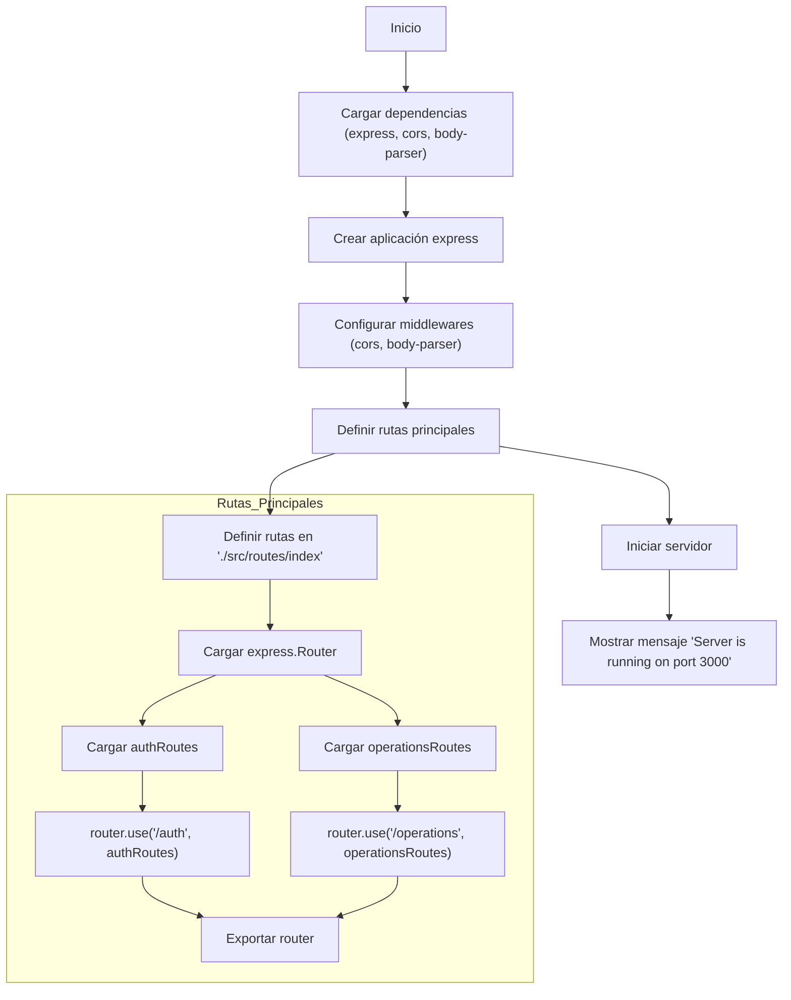

```mermaid
graph TD
    A["Inicio"] --> B["Cargar dependencias (express, cors, body-parser)"]
    B --> C["Crear aplicación express"]
    C --> D["Configurar middlewares (cors, body-parser)"]
    D --> E["Definir rutas principales"]
    E --> F["Iniciar servidor"]
    F --> G["Mostrar mensaje 'Server is running on port 3000'"]
    E --> H["Definir rutas en './src/routes/index'"]
    
    subgraph Rutas_Principales
        H --> I["Cargar express.Router"]
        I --> J["Cargar authRoutes"]
        I --> K["Cargar operationsRoutes"]
        J --> L["router.use('/auth', authRoutes)"]
        K --> M["router.use('/operations', operationsRoutes)"]
        L --> N["Exportar router"]
        M --> N["Exportar router"]
    end
```